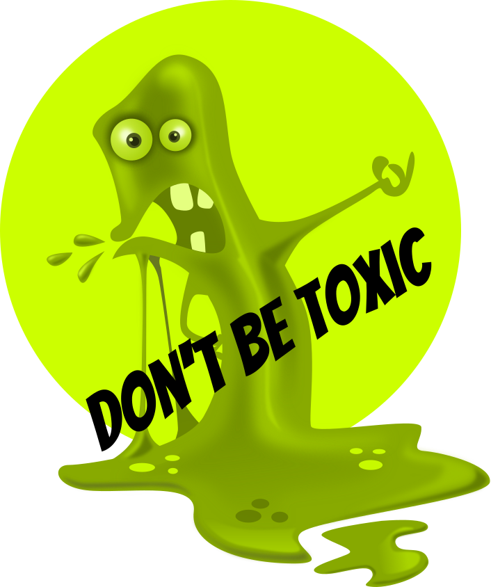

Project which helps to detect texts toxicity.

Run example:
```bash
git clone https://github.com/qooba/ai-toxicless-texts.git
cd ai-toxicless-texts
python3 -m http.server
```



Toxic slime image <a href="https://pixabay.com/pl/users/clker-free-vector-images-3736/?utm_source=link-attribution&amp;utm_medium=referral&amp;utm_campaign=image&amp;utm_content=41294"> Clker-Free-Vector-Images</a> from <a href="https://pixabay.com/pl/?utm_source=link-attribution&amp;utm_medium=referral&amp;utm_campaign=image&amp;utm_content=41294"> Pixabay</a>.

